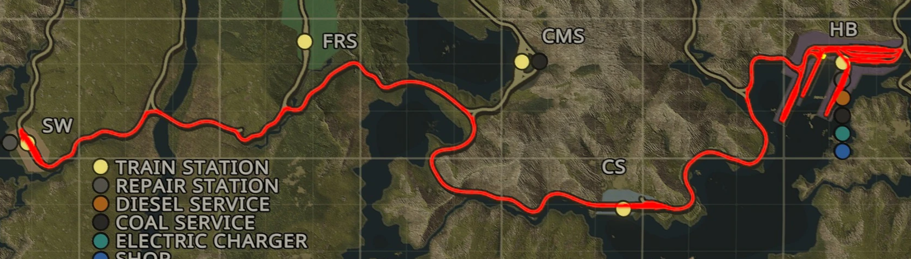

# Accurate Time Bonus

Distance calculation based on actual track geometry making time bonuses and job payouts more consistent.

## How it works
Derail Valley uses straight-line distances between stations to calculate time bonuses and job payouts. 
Depending on whether two stations are connected by a relatively straight rail segment or not, this makes some time bonuses very tight and others overly generous.
This mod uses the in-game track geometry and path finding algorithms to find the shortest drivable distance between stations. 
This makes time bonuses and job payouts more consistent and more in line with the actual time it takes to complete a job.

## Settings
Provides the option to adjust the mod's distance calculation to preserve vanilla-like average time bonuses. 
This option is provided, since the actual track distance between most stations is significantly longer than the straight-line distance, making time bonuses and payouts significantly higher.
This option is enabled by default.

## Examples

The table below shows the changes in time bonuses for selected connections in minutes.

| Connection       | Vanilla | Accurate | Scaled (default) |
|:-----------------|--------:|---------:|-----------------:|
| OWN &harr; GF    | 10      | 22       | 14               |
| HB  &harr; CME   | 60      | 105      | 65               |
| SM  &harr; GF    | 46      | 50       | 31               |
| OWC &harr; FM    | 9       | 9        | 6                |
| CME &harr; GF    | 21      | 97       | 60               |

OWN &harr; GF and HB &harr; CME are two connections that require a significant deviation from the straight-line distance, making their accurate time bonuses much higher.
Due to the mod's scaling, which is enabled by default, the scaled time bonus is only slightly longer.
The scaling is based on the average time bonus of all possible connections and preserves the overall vanilla balancing.

The opposite is the case for SM &harr; GF, where an almost straight-line connection exists, resulting in a very similar accurate and much lower scaled time bonus.

OWC &harr; FM and CME &harr; GF are the connections with the most extreme adjustments percentagewise.

## Mod Compatibility
This mod should be compatible with most mods.
If you are having problems, please disable the other mods to check if they are conflicting.

Mods known to work:
- [Mapify Continued](https://github.com/t0stiman/dv-mapify)

## Roadmap
- Include track curvatures, which correlate to the speed you can drive on a section, alongside the raw track length when determining time bonuses
- Rework shunting job time bonus calculation

## Contributing
Please report bugs or improvement suggestions by creating an issue.
